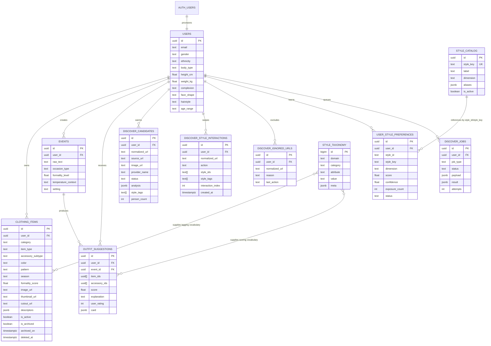

# LuxeLook AI Data Model

This document is the conceptual reference for LuxeLook AI's current product data.
For the full system view, including access control, activity flow, and architecture diagrams, see:
- [`/Users/anki/Desktop/Code/LuxeLookAI/luxelook-ai/docs/system-architecture.md`](/Users/anki/Desktop/Code/LuxeLookAI/luxelook-ai/docs/system-architecture.md)

It is intended to be read alongside:
- [`/Users/anki/Desktop/Code/LuxeLookAI/luxelook-ai/backend/schema.sql`](/Users/anki/Desktop/Code/LuxeLookAI/luxelook-ai/backend/schema.sql)
- [`/Users/anki/Desktop/Code/LuxeLookAI/luxelook-ai/backend/supabase_migrations.sql`](/Users/anki/Desktop/Code/LuxeLookAI/luxelook-ai/backend/supabase_migrations.sql)

The goal here is not just raw DDL. This file explains:
- what each table means in product terms
- which tables are primary vs derived/cache-like
- how data cascades on delete
- how the wardrobe, event, and Discover systems relate

All timestamps are stored in UTC in the database. Some application logic, such as Discover daily quota checks, interprets those UTC timestamps in the client’s local timezone at request time.

## Domain Overview

LuxeLook AI currently has five main data domains:

1. `Identity & profile`
2. `Wardrobe`
3. `Occasions & outfit suggestions`
4. `Style vocabulary / taxonomy`
5. `Discover taste learning`

## Entity Relationship Diagram



## Lifecycle and Cascade Rules

The most important cascade rule in the app today:

- Deleting a row in `users` cascades into:
  - `clothing_items`
  - `events`
  - `outfit_suggestions`
  - `discover_candidates`
  - `discover_style_interactions`
  - `discover_ignored_urls`
  - `user_style_preferences`
  - `discover_jobs`

These Discover tables do **not** cascade into one another directly.

Examples:
- deleting a Discover candidate does not delete its swipe interactions
- deleting a Discover interaction does not delete learned preference rows
- deleting the user deletes all of them

## Table-by-Table Conceptual Model

### 1. `auth.users` (external Supabase auth table)

This is the identity source managed by Supabase Auth, not by app code.

Purpose:
- canonical authentication identity
- source of the UUID copied into `public.users`

App relationship:
- `public.users.id` references `auth.users.id`
- `handle_new_user()` backfills the app profile row on signup

### 2. `public.users`

Product meaning:
- the persisted personal stylist profile for one signed-in user

Primary responsibilities:
- demographic/profile context
- styling context
- avatar and AI profiling image references

Record sketch:

```yaml
users:
  id: uuid
  email: text
  gender: text
  ethnicity: text
  body_type: text?
  height_cm: float?
  weight_kg: float?
  complexion: text?
  face_shape: text?
  hairstyle: text?
  age_range: text?
  photo_url: text?
  ai_profile_photo_url: text?
  ai_profile_analysis: jsonb
  ai_profile_analyzed_at: timestamptz?
  is_pro: boolean
  created_at: timestamptz
```

Notes:
- `gender` and `ethnicity` default to `prefer_not_to_say`
- `ai_profile_analysis` is structured but intentionally flexible JSON
- this table is intentionally kept clean; Discover learning lives in separate tables

### 3. `public.clothing_items`

Product meaning:
- one wardrobe item owned by one user

Primary responsibilities:
- garment identity and categorization
- source/original image and derived media
- style descriptors
- archive / active state

Record sketch:

```yaml
clothing_items:
  id: uuid
  user_id: uuid
  category: text
  item_type: text
  accessory_subtype: text?
  color: text?
  pattern: text?
  season: text
  formality_score: float?
  image_url: text
  thumbnail_url: text?
  cutout_url: text?
  media_status: text?
  media_stage: text?
  media_error: text?
  media_updated_at: timestamptz?
  descriptors: jsonb
  embedding_vector: vector(512)?
  is_active: boolean
  is_archived: boolean
  archived_on: timestamptz?
  deleted_at: timestamptz?
  updated_at: timestamptz
  created_at: timestamptz
```

Notes:
- `descriptors` is migration-added JSONB and conceptually part of the live schema
- `is_active = false` plus `is_archived = true` represents the archived state
- `thumbnail_url` and `cutout_url` are derived media, not user-authored data
- `embedding_vector` powers duplicate detection and visual similarity

### 4. `public.events`

Product meaning:
- a parsed occasion request from the user

Primary responsibilities:
- preserve the user’s original event description
- persist normalized occasion context for recommendation scoring

Record sketch:

```yaml
events:
  id: uuid
  user_id: uuid
  raw_text: text
  occasion_type: text
  formality_level: float?
  temperature_context: text?
  setting: text?
  created_at: timestamptz
```

### 5. `public.outfit_suggestions`

Product meaning:
- one scored outfit recommendation associated with one user and one event

Primary responsibilities:
- preserve the actual item combination
- store score, explanation, rating, and structured summary card

Record sketch:

```yaml
outfit_suggestions:
  id: uuid
  user_id: uuid
  event_id: uuid
  item_ids: uuid[]
  accessory_ids: uuid[]
  score: float?
  explanation: text?
  user_rating: int?
  card: jsonb?
  generated_at: timestamptz
```

Notes:
- `card` is a migration-added structured summary used by Event, Archive, and Style Item
- `item_ids` contains the core garments
- `accessory_ids` contains attached finishing pieces, including accessories and jewelry
- rating is combo-level feedback, not per-item feedback

### 6. `public.style_taxonomy`

Product meaning:
- the DB-resident fashion vocabulary registry

Primary responsibilities:
- descriptor vocabularies
- CLIP label prompts
- color mappings
- body-type preference vocab
- event token vocabulary

Record sketch:

```yaml
style_taxonomy:
  id: bigint
  domain: text
  category: text
  attribute: text
  value: text
  meta: jsonb
  sort_order: int
  is_active: boolean
  created_at: timestamptz
  updated_at: timestamptz
```

Notes:
- this is closer to a controlled vocabulary / configuration table than a transactional table
- it feeds tagging, scoring, and vocabulary resolution throughout the app

### 7. `public.style_catalog`

Product meaning:
- the canonical style-signal catalog used for Discover preference learning

Primary responsibilities:
- define style IDs/keys used by Discover interactions and learned preferences

Record sketch:

```yaml
style_catalog:
  id: uuid
  style_key: text
  label: text
  dimension: text
  description: text?
  aliases: jsonb
  sort_order: int
  is_active: boolean
  created_at: timestamptz
  updated_at: timestamptz
```

Difference from `style_taxonomy`:
- `style_taxonomy` is broad fashion vocabulary/configuration
- `style_catalog` is the curated style-signal set used by Discover learning

### 8. `public.discover_candidates`

Product meaning:
- per-user cached Discover candidates before or after analysis

Primary responsibilities:
- store source results from Pexels/mock provider
- persist analysis outcome
- act as the warm cache for the Discover feed

Record sketch:

```yaml
discover_candidates:
  id: uuid
  user_id: uuid
  normalized_url: text
  source_url: text
  image_url: text
  thumbnail_url: text?
  source_domain: text?
  provider_name: text?
  title: text
  summary: text?
  source_note: text?
  search_query: text?
  status: text
  analysis: jsonb
  style_tags: text[]
  style_ids: text[]
  person_count: int
  is_single_person: boolean
  last_error: text?
  last_analyzed_at: timestamptz?
  created_at: timestamptz
  updated_at: timestamptz
```

Status model:
- `queued`
- `ready`
- `filtered`
- `failed`

### 9. `public.discover_style_interactions`

Product meaning:
- the immutable swipe log for Discover

Primary responsibilities:
- preserve every `love`, `like`, and `dislike`
- store the exact card/style snapshot that was shown
- serve as the evidence source for learned preferences

Record sketch:

```yaml
discover_style_interactions:
  id: uuid
  user_id: uuid
  card_id: text
  source_url: text
  normalized_url: text
  image_url: text
  thumbnail_url: text?
  source_domain: text?
  title: text
  summary: text?
  search_query: text?
  style_ids: text[]
  style_tags: text[]
  action: text
  person_count: int
  is_single_person: boolean
  analysis: jsonb
  interaction_index: int?
  created_at: timestamptz
```

This is the source of truth for:
- total Discover interaction count
- local-day quota count
- later preference recomputes

### 10. `public.discover_ignored_urls`

Product meaning:
- per-user exclusion registry for Discover links

Primary responsibilities:
- prevent already-acted-on links from recycling back into the feed

Record sketch:

```yaml
discover_ignored_urls:
  id: uuid
  user_id: uuid
  source_url: text
  normalized_url: text
  image_url: text?
  thumbnail_url: text?
  source_domain: text?
  search_query: text?
  last_action: text?
  reason: text?
  last_seen_at: timestamptz
  created_at: timestamptz
```

Important current behavior:
- user-facing excluded counts should reflect actual swiped/ignored links
- being merely shown in the feed should not permanently exclude a card

### 11. `public.user_style_preferences`

Product meaning:
- the derived, user-specific style profile computed from Discover history

Primary responsibilities:
- aggregate evidence per style signal
- expose which signals are preferred, disliked, or still emerging

Record sketch:

```yaml
user_style_preferences:
  id: uuid
  user_id: uuid
  style_id: text
  style_key: text
  label: text
  dimension: text
  score: float
  confidence: float
  exposure_count: int
  love_count: int
  like_count: int
  dislike_count: int
  positive_count: int
  negative_count: int
  status: text
  last_interaction_at: timestamptz?
  updated_at: timestamptz
  created_at: timestamptz
```

This table is:
- derived
- rebuildable from `discover_style_interactions`
- intentionally separate from `users`

### 12. `public.discover_jobs`

Product meaning:
- the durable background job queue for Discover

Primary responsibilities:
- warm candidate pools
- recompute user style preferences
- support retries, dedupe, and worker recovery

Record sketch:

```yaml
discover_jobs:
  id: uuid
  user_id: uuid
  job_type: text
  status: text
  priority: int
  payload: jsonb
  dedupe_key: text?
  attempts: int
  max_attempts: int
  scheduled_for: timestamptz
  locked_at: timestamptz?
  locked_by: text?
  last_error: text?
  result: jsonb?
  created_at: timestamptz
  updated_at: timestamptz
```

Typical job types:
- `seed_discover_candidates`
- `refresh_style_preferences`

## Derived vs Source-of-Truth Tables

### Primary source-of-truth tables
- `users`
- `clothing_items`
- `events`
- `outfit_suggestions`
- `discover_style_interactions`

### Controlled vocabulary / configuration tables
- `style_taxonomy`
- `style_catalog`

### Derived / cache / operational tables
- `discover_candidates`
- `discover_ignored_urls`
- `user_style_preferences`
- `discover_jobs`

## Storage Buckets

The current Supabase storage model complements the relational schema:

- `clothing-images` (private)
  - original wardrobe uploads
  - derived thumbnails
  - derived cutouts
- `profile-photos` (public)
  - user-visible avatar/profile image
- `ai-profile-photos` (public)
  - dedicated AI profiling image

These buckets are referenced by URL fields in `clothing_items` and `users`; they are not represented as relational tables in the app schema.

## Practical Reading Guide

If you are debugging or extending a feature, start here:

- `Wardrobe upload/edit/archive`
  - `users`
  - `clothing_items`
  - storage buckets

- `Event generation and Archive history`
  - `events`
  - `outfit_suggestions`
  - `clothing_items`

- `Discover`
  - `discover_candidates`
  - `discover_style_interactions`
  - `discover_ignored_urls`
  - `user_style_preferences`
  - `discover_jobs`
  - `style_catalog`

- `Vocabulary / tagging / scoring behavior`
  - `style_taxonomy`
  - `style_catalog`

## Current Design Intent

The overall model aims to keep:
- user identity/profile clean
- wardrobe items durable and media-aware
- recommendation history explicit
- Discover learning explainable and rebuildable
- style vocabularies configurable without hard-coding everything in app logic

That separation is one of the key architectural choices in the current version of LuxeLook AI.
