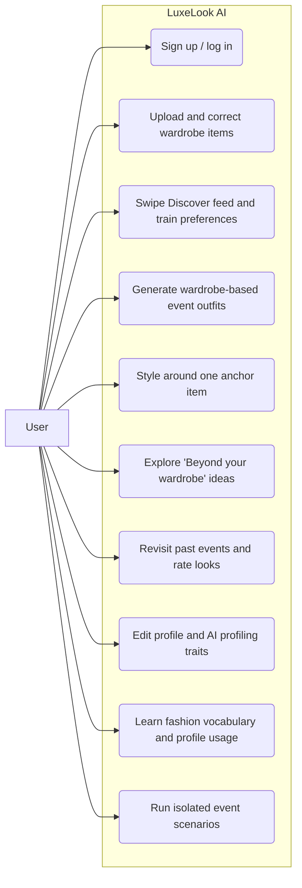
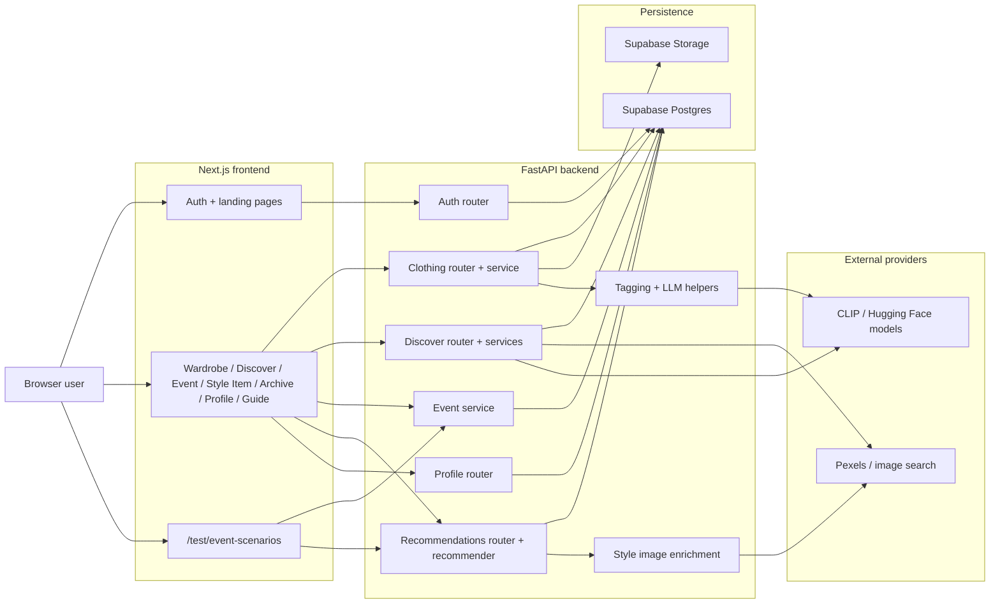
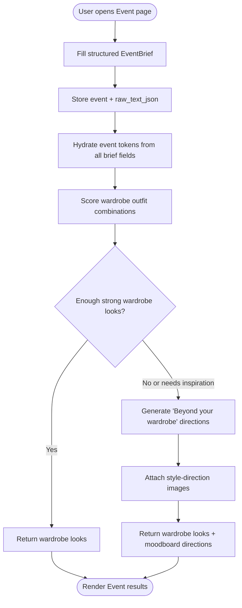
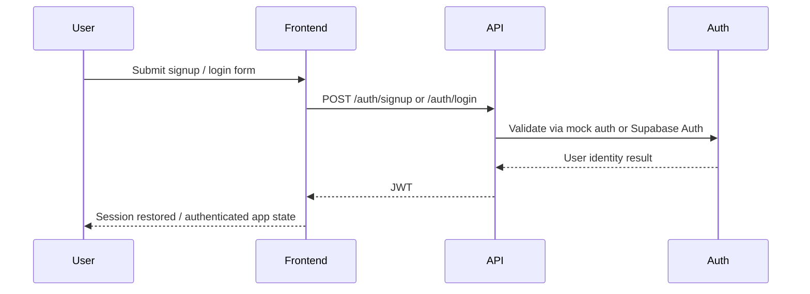
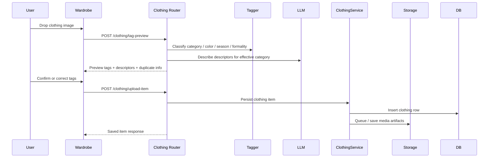
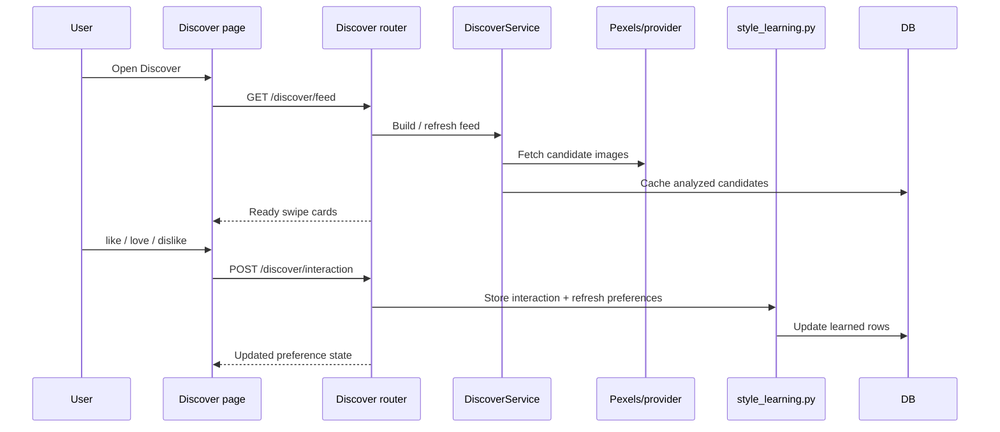
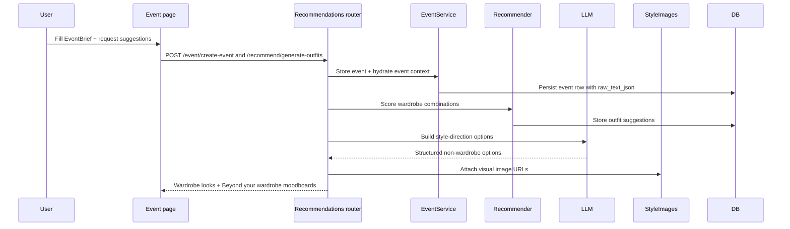

# LuxeLook AI Activity Map

Updated: 2026-04-20

This file is the current source-of-truth activity walkthrough for LuxeLook AI.
It replaces the older March 2026 activity PDF that still referenced legacy routes such as `/events` and `/outfits`.

Read this alongside:
- [/Users/anki/Desktop/Code/LuxeLookAI/luxelook-ai/README.md](/Users/anki/Desktop/Code/LuxeLookAI/luxelook-ai/README.md)
- [/Users/anki/Desktop/Code/LuxeLookAI/luxelook-ai/docs/system-architecture.md](/Users/anki/Desktop/Code/LuxeLookAI/luxelook-ai/docs/system-architecture.md)
- [/Users/anki/Desktop/Code/LuxeLookAI/luxelook-ai/docs/data-model.md](/Users/anki/Desktop/Code/LuxeLookAI/luxelook-ai/docs/data-model.md)

## Current user-facing surfaces

- `/` landing + auth
- `/wardrobe`
- `/discover`
- `/event`
- `/archive`
- `/style-item`
- `/profile`
- `/guide`
- `/test/event-scenarios` (isolated testing surface)

Legacy redirects:
- `/events` -> `/event`
- `/outfits` -> `/archive`

## Diagram strategy

These diagram types are the most useful for this product:
- `Use case` for the user-facing surfaces and what the user can do.
- `Component` for the frontend / backend / data / provider boundaries.
- `Activity` for decision-heavy flows like Event generation.
- `Sequence` for request-by-request backend detail.

These are less useful in this document:
- `Communication` diagrams mostly duplicate the sequence diagrams without adding much clarity here.
- `GoF design pattern` diagrams are better suited to code internals than product flows, so they are not the right primary tool for this activity map.

## Use-case view

## Component view

## Activity view: Event recommendation

## 1. User opens the app

Frontend:
- [/Users/anki/Desktop/Code/LuxeLookAI/luxelook-ai/frontend/pages/_app.tsx](/Users/anki/Desktop/Code/LuxeLookAI/luxelook-ai/frontend/pages/_app.tsx)
- [/Users/anki/Desktop/Code/LuxeLookAI/luxelook-ai/frontend/hooks/useAuth.tsx](/Users/anki/Desktop/Code/LuxeLookAI/luxelook-ai/frontend/hooks/useAuth.tsx)
- [/Users/anki/Desktop/Code/LuxeLookAI/luxelook-ai/frontend/pages/index.tsx](/Users/anki/Desktop/Code/LuxeLookAI/luxelook-ai/frontend/pages/index.tsx)

Flow:
1. Browser loads the Next.js app shell.
2. `useAuth` restores the cached JWT session on refresh when possible.
3. If authenticated, the user is routed into the app.
4. If not authenticated, the landing/auth surface stays visible and now defaults to the sign-up / `Get started` state instead of the sign-in view.

## 2. Signup / Login

Frontend:
- [/Users/anki/Desktop/Code/LuxeLookAI/luxelook-ai/frontend/pages/index.tsx](/Users/anki/Desktop/Code/LuxeLookAI/luxelook-ai/frontend/pages/index.tsx)
- [/Users/anki/Desktop/Code/LuxeLookAI/luxelook-ai/frontend/hooks/useAuth.tsx](/Users/anki/Desktop/Code/LuxeLookAI/luxelook-ai/frontend/hooks/useAuth.tsx)
- [/Users/anki/Desktop/Code/LuxeLookAI/luxelook-ai/frontend/services/api.ts](/Users/anki/Desktop/Code/LuxeLookAI/luxelook-ai/frontend/services/api.ts)

Backend:
- [/Users/anki/Desktop/Code/LuxeLookAI/luxelook-ai/backend/main.py](/Users/anki/Desktop/Code/LuxeLookAI/luxelook-ai/backend/main.py)
- [/Users/anki/Desktop/Code/LuxeLookAI/luxelook-ai/backend/routers/auth.py](/Users/anki/Desktop/Code/LuxeLookAI/luxelook-ai/backend/routers/auth.py)
- [/Users/anki/Desktop/Code/LuxeLookAI/luxelook-ai/backend/utils/auth.py](/Users/anki/Desktop/Code/LuxeLookAI/luxelook-ai/backend/utils/auth.py)
- [/Users/anki/Desktop/Code/LuxeLookAI/luxelook-ai/backend/utils/mock_auth_store.py](/Users/anki/Desktop/Code/LuxeLookAI/luxelook-ai/backend/utils/mock_auth_store.py)

Flow:
1. User submits signup or login form.
2. Frontend calls `/auth/signup` or `/auth/login`.
3. Backend uses mock auth or Supabase auth depending on environment.
4. JWT is returned.
5. Frontend stores the token and marks the session authenticated.

## 3. Wardrobe upload and correction

Frontend:
- [/Users/anki/Desktop/Code/LuxeLookAI/luxelook-ai/frontend/pages/wardrobe.tsx](/Users/anki/Desktop/Code/LuxeLookAI/luxelook-ai/frontend/pages/wardrobe.tsx)
- [/Users/anki/Desktop/Code/LuxeLookAI/luxelook-ai/frontend/services/api.ts](/Users/anki/Desktop/Code/LuxeLookAI/luxelook-ai/frontend/services/api.ts)

Backend:
- [/Users/anki/Desktop/Code/LuxeLookAI/luxelook-ai/backend/routers/clothing.py](/Users/anki/Desktop/Code/LuxeLookAI/luxelook-ai/backend/routers/clothing.py)
- [/Users/anki/Desktop/Code/LuxeLookAI/luxelook-ai/backend/services/clothing_service.py](/Users/anki/Desktop/Code/LuxeLookAI/luxelook-ai/backend/services/clothing_service.py)
- [/Users/anki/Desktop/Code/LuxeLookAI/luxelook-ai/backend/ml/tagger.py](/Users/anki/Desktop/Code/LuxeLookAI/luxelook-ai/backend/ml/tagger.py)
- [/Users/anki/Desktop/Code/LuxeLookAI/luxelook-ai/backend/ml/llm.py](/Users/anki/Desktop/Code/LuxeLookAI/luxelook-ai/backend/ml/llm.py)
- [/Users/anki/Desktop/Code/LuxeLookAI/luxelook-ai/backend/ml/embeddings.py](/Users/anki/Desktop/Code/LuxeLookAI/luxelook-ai/backend/ml/embeddings.py)

Flow:
1. User drops an image into Wardrobe.
2. Frontend calls `/clothing/tag-preview`.
3. Backend classifies category, color, season, and formality.
4. Descriptor extraction runs for the effective category.
5. Duplicate detection checks whether the item already exists.
6. User reviews AI tags and can correct category, color, pattern, season, formality, and descriptors.
7. If the user changes the category during review, preview tagging is rerun for the new category so descriptors refresh before save.
8. Frontend calls `/clothing/upload-item`.
9. Backend persists the item and starts background media processing.
10. Wardrobe shows activity-tray progress for thumbnail/cutout generation.

### Correction feedback logging

Backend:
- [/Users/anki/Desktop/Code/LuxeLookAI/luxelook-ai/backend/services/clothing_service.py](/Users/anki/Desktop/Code/LuxeLookAI/luxelook-ai/backend/services/clothing_service.py)

Flow:
1. User edits AI-generated wardrobe tags later.
2. The app stores per-field correction feedback.
3. Snapshot fields preserve the item context at correction time.
4. This creates structured future tuning / analytics data.

## 4. Discover / The Edit

Frontend:
- [/Users/anki/Desktop/Code/LuxeLookAI/luxelook-ai/frontend/pages/discover.tsx](/Users/anki/Desktop/Code/LuxeLookAI/luxelook-ai/frontend/pages/discover.tsx)

Backend:
- [/Users/anki/Desktop/Code/LuxeLookAI/luxelook-ai/backend/routers/discover.py](/Users/anki/Desktop/Code/LuxeLookAI/luxelook-ai/backend/routers/discover.py)
- [/Users/anki/Desktop/Code/LuxeLookAI/luxelook-ai/backend/services/discover_service.py](/Users/anki/Desktop/Code/LuxeLookAI/luxelook-ai/backend/services/discover_service.py)
- [/Users/anki/Desktop/Code/LuxeLookAI/luxelook-ai/backend/services/discover_search.py](/Users/anki/Desktop/Code/LuxeLookAI/luxelook-ai/backend/services/discover_search.py)
- [/Users/anki/Desktop/Code/LuxeLookAI/luxelook-ai/backend/services/style_learning.py](/Users/anki/Desktop/Code/LuxeLookAI/luxelook-ai/backend/services/style_learning.py)

Flow:
1. User opens Discover.
2. Backend builds or refreshes a taste-seeded candidate feed.
3. Pexels images are fetched and filtered to usable single-person fashion results.
4. Style tags are extracted and cached.
5. User swipes `like`, `love`, or `dislike`.
6. Raw interactions are stored.
7. Family-memory state is updated so the same visual type does not immediately repeat across refreshes or active Discover days.
8. Learned preferences are recomputed into `user_style_preferences`.
9. The UI renders Likes / Dislikes rails from those learned rows as descriptor-style pills.

## 5. Event creation and outfit generation

## 4.5 Route-level page visit logging

Frontend:
- [/Users/anki/Desktop/Code/LuxeLookAI/luxelook-ai/frontend/pages/_app.tsx](/Users/anki/Desktop/Code/LuxeLookAI/luxelook-ai/frontend/pages/_app.tsx)
- [/Users/anki/Desktop/Code/LuxeLookAI/luxelook-ai/frontend/services/api.ts](/Users/anki/Desktop/Code/LuxeLookAI/luxelook-ai/frontend/services/api.ts)

Backend:
- [/Users/anki/Desktop/Code/LuxeLookAI/luxelook-ai/backend/routers/activity.py](/Users/anki/Desktop/Code/LuxeLookAI/luxelook-ai/backend/routers/activity.py)
- [/Users/anki/Desktop/Code/LuxeLookAI/luxelook-ai/backend/services/page_visit_service.py](/Users/anki/Desktop/Code/LuxeLookAI/luxelook-ai/backend/services/page_visit_service.py)

Flow:
1. Frontend starts one active page-visit row when a route becomes active.
2. Same-page refreshes reuse the active visit row instead of creating a duplicate.
3. When the user navigates to another route, the previous page gets `left_at` and `duration_ms`.
4. The next route starts a new visit row.
5. This is route-level only; it does not track clickstream, mouse movement, or raw field input.

Frontend:
- [/Users/anki/Desktop/Code/LuxeLookAI/luxelook-ai/frontend/pages/event.tsx](/Users/anki/Desktop/Code/LuxeLookAI/luxelook-ai/frontend/pages/event.tsx)
- [/Users/anki/Desktop/Code/LuxeLookAI/luxelook-ai/frontend/components/EventBriefEditor.tsx](/Users/anki/Desktop/Code/LuxeLookAI/luxelook-ai/frontend/components/EventBriefEditor.tsx)

Backend:
- [/Users/anki/Desktop/Code/LuxeLookAI/luxelook-ai/backend/routers/recommendations.py](/Users/anki/Desktop/Code/LuxeLookAI/luxelook-ai/backend/routers/recommendations.py)
- [/Users/anki/Desktop/Code/LuxeLookAI/luxelook-ai/backend/services/event_service.py](/Users/anki/Desktop/Code/LuxeLookAI/luxelook-ai/backend/services/event_service.py)
- [/Users/anki/Desktop/Code/LuxeLookAI/luxelook-ai/backend/services/recommender.py](/Users/anki/Desktop/Code/LuxeLookAI/luxelook-ai/backend/services/recommender.py)

Flow:
1. User fills the structured EventBrief.
2. Frontend sends the readable event summary plus `raw_text_json`.
3. Backend stores the event row.
4. Event tokens are enriched from all EventBrief form fields.
5. Direct dress-code selections override weaker inferred formality.
6. Recommender scores wardrobe combinations.
7. Results are stored and returned to the UI.
8. Event page shows wardrobe suggestions plus the `Beyond your wardrobe` editorial lane.

### Beyond Your Wardrobe

Frontend:
- [/Users/anki/Desktop/Code/LuxeLookAI/luxelook-ai/frontend/components/StyleDirectionMoodboard.tsx](/Users/anki/Desktop/Code/LuxeLookAI/luxelook-ai/frontend/components/StyleDirectionMoodboard.tsx)

Backend:
- [/Users/anki/Desktop/Code/LuxeLookAI/luxelook-ai/backend/ml/llm.py](/Users/anki/Desktop/Code/LuxeLookAI/luxelook-ai/backend/ml/llm.py)
- [/Users/anki/Desktop/Code/LuxeLookAI/luxelook-ai/backend/services/style_images.py](/Users/anki/Desktop/Code/LuxeLookAI/luxelook-ai/backend/services/style_images.py)

Flow:
1. LLM produces structured style-direction options.
2. Each wearable piece can be enriched with an external reference image.
3. Frontend renders those pieces as a visual moodboard.
4. Hair and makeup remain separate finishing pieces below the board.

## 6. Style Item

Frontend:
- [/Users/anki/Desktop/Code/LuxeLookAI/luxelook-ai/frontend/pages/style-item.tsx](/Users/anki/Desktop/Code/LuxeLookAI/luxelook-ai/frontend/pages/style-item.tsx)

Backend:
- [/Users/anki/Desktop/Code/LuxeLookAI/luxelook-ai/backend/routers/recommendations.py](/Users/anki/Desktop/Code/LuxeLookAI/luxelook-ai/backend/routers/recommendations.py)
- [/Users/anki/Desktop/Code/LuxeLookAI/luxelook-ai/backend/services/recommender.py](/Users/anki/Desktop/Code/LuxeLookAI/luxelook-ai/backend/services/recommender.py)

Flow:
1. User selects one wardrobe item as the anchor piece.
2. User fills the same structured brief editor used by Event.
3. Backend tries to build outfit suggestions around that anchor item.
4. If a complete wardrobe look is not possible, editorial style direction fills the gap.

## 7. Archive

Frontend:
- [/Users/anki/Desktop/Code/LuxeLookAI/luxelook-ai/frontend/pages/archive.tsx](/Users/anki/Desktop/Code/LuxeLookAI/luxelook-ai/frontend/pages/archive.tsx)

Backend:
- [/Users/anki/Desktop/Code/LuxeLookAI/luxelook-ai/backend/routers/recommendations.py](/Users/anki/Desktop/Code/LuxeLookAI/luxelook-ai/backend/routers/recommendations.py)
- [/Users/anki/Desktop/Code/LuxeLookAI/luxelook-ai/backend/services/event_service.py](/Users/anki/Desktop/Code/LuxeLookAI/luxelook-ai/backend/services/event_service.py)

Flow:
1. Archive loads past events and their stored suggestions.
2. Event summaries are rebuilt from structured event JSON into readable sentences.
3. Users can revisit, compare, and rate historical looks.
4. Saved combo ratings persist when the same outfit appears again.

## 8. Rating, skipping, and refresh

Frontend:
- [/Users/anki/Desktop/Code/LuxeLookAI/luxelook-ai/frontend/components/OutfitSuggestionCard.tsx](/Users/anki/Desktop/Code/LuxeLookAI/luxelook-ai/frontend/components/OutfitSuggestionCard.tsx)

Backend:
- [/Users/anki/Desktop/Code/LuxeLookAI/luxelook-ai/backend/routers/feedback.py](/Users/anki/Desktop/Code/LuxeLookAI/luxelook-ai/backend/routers/feedback.py)
- [/Users/anki/Desktop/Code/LuxeLookAI/luxelook-ai/backend/routers/recommendations.py](/Users/anki/Desktop/Code/LuxeLookAI/luxelook-ai/backend/routers/recommendations.py)

Flow:
1. User rates a look from 1 to 5 stars, or rejects a batch via `None of these looks`.
2. Rating is written against the stored suggestion row.
3. A `0` rating is now valid for the reject / skip flow.
4. Refreshes avoid exact duplicate combos when fresher alternatives exist.
5. Existing combo ratings carry forward when the same look is regenerated.

## 9. Profile and AI profiling photo

Frontend:
- [/Users/anki/Desktop/Code/LuxeLookAI/luxelook-ai/frontend/pages/profile.tsx](/Users/anki/Desktop/Code/LuxeLookAI/luxelook-ai/frontend/pages/profile.tsx)

Backend:
- [/Users/anki/Desktop/Code/LuxeLookAI/luxelook-ai/backend/routers/profile.py](/Users/anki/Desktop/Code/LuxeLookAI/luxelook-ai/backend/routers/profile.py)
- [/Users/anki/Desktop/Code/LuxeLookAI/luxelook-ai/backend/ml/llm.py](/Users/anki/Desktop/Code/LuxeLookAI/luxelook-ai/backend/ml/llm.py)

Flow:
1. User edits body details and style-relevant profile traits.
2. Visible avatar and AI profiling photo remain separate paths.
3. AI analysis can suggest face shape, body type, complexion, hair traits, and related profile fields.
4. Saved profile traits feed future styling and Discover seeding.

## 10. Guide

Frontend:
- [/Users/anki/Desktop/Code/LuxeLookAI/luxelook-ai/frontend/pages/guide.tsx](/Users/anki/Desktop/Code/LuxeLookAI/luxelook-ai/frontend/pages/guide.tsx)

Flow:
1. User opens the in-app Guide.
2. The page explains wardrobe vocabulary:
   - dress code ladder
   - season readings
   - neckline / fit / length examples
3. It also explains how profile information influences recommendations.
4. This is a frontend-only education surface; no backend request is required.

## 11. Event scenario tester

Frontend:
- [/Users/anki/Desktop/Code/LuxeLookAI/luxelook-ai/frontend/pages/test/event-scenarios.tsx](/Users/anki/Desktop/Code/LuxeLookAI/luxelook-ai/frontend/pages/test/event-scenarios.tsx)
- [/Users/anki/Desktop/Code/LuxeLookAI/luxelook-ai/frontend/test/eventScenarios.ts](/Users/anki/Desktop/Code/LuxeLookAI/luxelook-ai/frontend/test/eventScenarios.ts)

Flow:
1. Tester loads saved EventBrief JSON scenarios.
2. User can edit them using the same shared form as the main Event page.
3. The test page calls the real recommendation flow.
4. Results render below, including the visual style-direction lane.

## Key current differences from the old PDF

The older PDF is stale because it still assumes:
- `pages/events.tsx`
- `pages/outfits.tsx`
- `routers/events.py`
- no Guide page
- no Style Item page
- no event scenario tester
- no visual `Beyond your wardrobe` moodboards
- no structured EventBrief completeness
- no Discover preference reliability fixes

This Markdown file reflects the current app state as of 2026-04-16.
