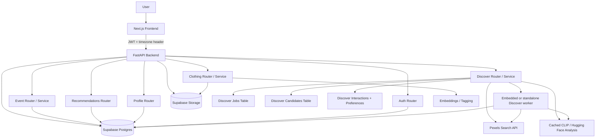
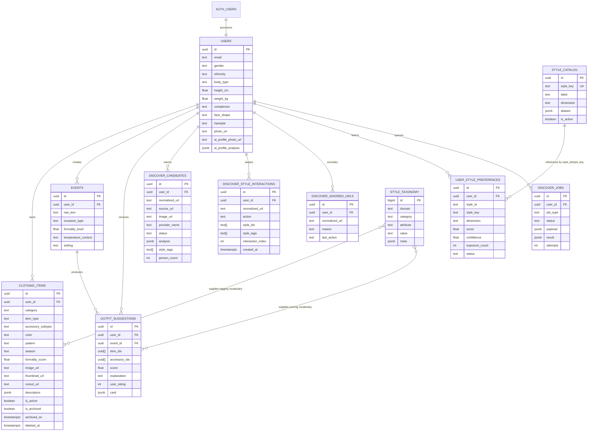

# LuxeLook AI System Architecture

This document is the current conceptual reference for LuxeLook AI's system design, database modeling, access control, and activity flows.

It is intended to be read alongside:
- [`/Users/anki/Desktop/Code/LuxeLookAI/luxelook-ai/backend/schema.sql`](/Users/anki/Desktop/Code/LuxeLookAI/luxelook-ai/backend/schema.sql)
- [`/Users/anki/Desktop/Code/LuxeLookAI/luxelook-ai/backend/supabase_migrations.sql`](/Users/anki/Desktop/Code/LuxeLookAI/luxelook-ai/backend/supabase_migrations.sql)
- [`/Users/anki/Desktop/Code/LuxeLookAI/luxelook-ai/README.md`](/Users/anki/Desktop/Code/LuxeLookAI/luxelook-ai/README.md)

The goal is not just raw DDL. This file explains:
- the system architecture and request boundaries
- the access-control model and how Supabase roles are used
- how the wardrobe, event, archive, and Discover flows operate
- what each table means in product terms
- which tables are source-of-truth vs derived/cache-like
- how data cascades on delete

All timestamps are stored in UTC in the database. Some application logic, such as Discover daily quota checks, interprets those UTC timestamps in the client’s local timezone at request time while still keeping storage standardized in UTC.

## Executive Summary

LuxeLook AI is a modular monolith:
- `Next.js` frontend
- `FastAPI` backend
- `Supabase Postgres` as the primary data store
- `Supabase Storage` for images and media artifacts
- `DB-backed background jobs` for Discover and media processing
- `hybrid AI` where CLIP / Hugging Face powers local visual understanding and the backend retains a provider abstraction for external search sources

The backend is the trust boundary.
- The frontend calls FastAPI over HTTP and carries the user JWT.
- FastAPI uses the Supabase `service_role` key for trusted backend writes and worker activity.
- User-scoped tables still have Row Level Security for defense in depth and future direct access patterns.

## Architecture Diagram

## System Activity Flow

### 1. Authentication

1. User signs up or logs in from the frontend.
2. Frontend sends credentials to FastAPI.
3. FastAPI either:
   - uses mock auth for local development, or
   - delegates to Supabase Auth in real mode.
4. A JWT is returned to the browser and stored locally.
5. The backend reads the JWT on every request and resolves the active user.

### 2. Wardrobe upload

1. User uploads a clothing photo.
2. Frontend posts the file to FastAPI.
3. Backend runs preview/tagging logic and saves the item.
4. The item is written to `clothing_items`.
5. Background media tasks generate thumbnails and cutouts.
6. The wardrobe page updates with live media status.

### 3. Event to outfit suggestions

1. User enters an occasion or event description.
2. Backend parses the occasion and computes formality context.
3. Recommender scores wardrobe combinations.
4. Results are stored in `outfit_suggestions`.
5. The archive page and event page render those suggestions and feedback states.

### 4. Discover / The Edit

1. User opens Discover.
2. Backend builds a seed query from profile context and learned style signals.
3. A warm-up job fetches candidates from Pexels.
4. Candidate analysis filters to single-person fashion images and extracts style tags.
5. Ready candidates are cached in `discover_candidates`.
6. The feed serves ready candidates to the UI.
7. User swipes like / love / dislike.
8. Swipe events are written to `discover_style_interactions`.
9. Preference rows in `user_style_preferences` are recomputed after enough evidence accumulates.
10. Ignored URLs are updated only from actual interactions, not merely from being shown.

### 5. Archive

1. A wardrobe item is soft-deleted by the user.
2. The row is marked inactive and archived.
3. Archived items remain recoverable.
4. After the purge window, archived items may be permanently removed by cleanup logic.

## Access Control Model

### Recommended role model

For this codebase, the standard and safest pattern is:
- `authenticated` for end-user identity
- `service_role` for trusted backend CRUD and workers
- Row Level Security for user-scoped tables

This is the current implementation shape:
- frontend talks to FastAPI
- FastAPI talks to Supabase using the `service_role` key
- RLS still protects user-owned rows if the access pattern changes later

### Why not a single custom DB role for everything?

A single custom role sounds neat, but it is not the standard Supabase application pattern.

In this app:
- the frontend does not access Supabase directly
- the backend is already the authority for CRUD
- `service_role` is the natural trusted path for server-side operations
- `authenticated` + RLS remains the correct end-user model

### Access matrix

| Resource | Read | Write | Mechanism | Notes |
|---|---|---|---|---|
| `auth.users` | Supabase Auth only | Supabase Auth only | platform-managed | External identity source |
| `users` | owner, backend | owner, backend | RLS + backend `service_role` | New users are inserted by the signup trigger / auth path |
| `clothing_items` | owner, backend | owner, backend | RLS + backend `service_role` | Wardrobe CRUD for new users should work because `users` rows are auto-provisioned |
| `events` | owner, backend | owner, backend | RLS + backend `service_role` | Event creation depends on the `users` row existing |
| `outfit_suggestions` | owner, backend | backend; owner can rate | RLS + backend `service_role` | Generated from the recommender |
| `style_catalog` | authenticated users | backend/admin seeding | read-only | Shared canonical style vocabulary |
| `style_taxonomy` | backend/admin | backend/admin | service-side / migration-side | Vocabulary for garment tagging and recommendation scoring |
| `discover_candidates` | owner, backend worker | backend worker | RLS + backend `service_role` | Cache of warm-up candidates |
| `discover_style_interactions` | owner, backend | backend | RLS + backend `service_role` | Raw swipe log |
| `discover_ignored_urls` | owner, backend worker | backend worker | RLS + backend `service_role` | Only actual interactions should populate this |
| `user_style_preferences` | owner, backend | backend | RLS + backend `service_role` | Derived taste summary |
| `discover_jobs` | owner, backend worker | backend worker | RLS + backend `service_role` | Durable job queue |
| `storage.objects` wardrobe/profile buckets | owner, backend | owner, backend | storage policies + backend `service_role` | Media files and profile photos |

### New user safety

New users should not have trouble creating wardrobe items or events because:
- `auth.users` signup is mirrored into `public.users`
- the backend uses `service_role`
- user-owned tables have explicit insert policies
- foreign keys from user-owned tables point to `users(id)` which is provisioned on signup

If you ever move more CRUD directly into the browser, then the RLS policies should be expanded first. Today that is not required because the browser only talks to the FastAPI backend.

## Database Model

### Domain overview

LuxeLook AI has five main data domains:

1. `Identity & profile`
2. `Wardrobe`
3. `Occasions & outfit suggestions`
4. `Style vocabulary / taxonomy`
5. `Discover taste learning`

### Conceptual ER diagram

### Table semantics

#### 1. `auth.users`

Purpose:
- canonical identity row managed by Supabase Auth

Role in the app:
- source of the UUID that keys `public.users`

#### 2. `public.users`

Purpose:
- the persisted stylist profile for one signed-in user

Important fields:
- `gender`
- `ethnicity`
- `body_type`
- `height_cm`
- `weight_kg`
- `complexion`
- `face_shape`
- `hairstyle`
- `photo_url`
- `ai_profile_photo_url`
- `ai_profile_analysis`

Notes:
- this table is intentionally clean
- Discover learning is kept in separate tables

#### 3. `public.clothing_items`

Purpose:
- one wardrobe item owned by one user

Important fields:
- garment category and subtype
- color, pattern, season, formality
- media and derivative imagery
- archive state
- descriptors / tags

#### 4. `public.events`

Purpose:
- user-described occasion or styling request

Important fields:
- raw event text
- parsed occasion type
- formality and context cues

#### 5. `public.outfit_suggestions`

Purpose:
- stored outfit generations for one event

Important fields:
- `item_ids`
- `accessory_ids` for finishing pieces, including accessories and jewelry
- `score`
- `explanation`
- `user_rating`

#### 6. `public.style_catalog`

Purpose:
- canonical, human-friendly style vocabulary for Discover learning

Important fields:
- `style_key`
- `label`
- `dimension`
- `aliases`

#### 7. `public.style_taxonomy`

Purpose:
- larger vocabulary table for garment tagging and scoring

Important fields:
- `domain`
- `category`
- `attribute`
- `value`
- `meta`

#### 8. `public.discover_candidates`

Purpose:
- cached image results warmed up for the Discover feed

Why it exists:
- prevents live search from being the only source of cards
- lets the worker analyze candidates ahead of time

#### 9. `public.discover_style_interactions`

Purpose:
- raw swipe history for Discover

Why it exists:
- source of truth for taste learning
- used to recompute derived preference rows

#### 10. `public.discover_ignored_urls`

Purpose:
- per-user ignore list of URLs already acted on

Important rule:
- should be populated by actual interactions, not simply by showing a card

#### 11. `public.user_style_preferences`

Purpose:
- derived taste profile for a user

Important fields:
- `score`
- `confidence`
- `exposure_count`
- `status`

#### 12. `public.discover_jobs`

Purpose:
- durable job queue for Discover warm-up and recomputation

Why it exists:
- gives the app async execution without introducing a heavier orchestration system

## Access Control Details

### RLS strategy

The app uses Row Level Security for user-owned tables:
- `users`
- `clothing_items`
- `events`
- `outfit_suggestions`
- `discover_candidates`
- `discover_style_interactions`
- `discover_ignored_urls`
- `user_style_preferences`
- `discover_jobs`

Current policy shape:
- select/update/insert are scoped with `auth.uid() = user_id` or `auth.uid() = id`
- `style_catalog` is readable
- the backend uses `service_role` for trusted writes and workers

### Role usage

The app currently uses:
- `authenticated` users through Supabase Auth for identity
- `service_role` from the backend for CRUD and worker operations

That means:
- the frontend is not directly holding database privilege
- the backend is the single trusted path
- user-level CRUD is still correctly bounded by ownership and RLS

### Practical implication for new users

New users can create wardrobe items and events without issue because:
- the auth signup path provisions the profile row
- the backend writes with `service_role`
- tables are already keyed by `user_id`
- ownership policies are in place for direct user-scoped access

## Operational Flows

### Wardrobe flow

1. User uploads an image.
2. Backend tags the image.
3. Item is inserted into `clothing_items`.
4. Media pipeline generates thumbnails and cutouts.
5. Wardrobe page renders the processed result.

### Event flow

1. User submits an occasion description.
2. Backend parses the request.
3. Recommender scores wardrobe combinations.
4. `outfit_suggestions` are written.
5. User rates or regenerates.

### Discover flow

1. Page opens and seeds a query from profile context.
2. Search provider fetches candidates.
3. Worker analyzes candidates.
4. Ready rows land in `discover_candidates`.
5. The feed renders swipeable cards.
6. User interacts.
7. Interactions update both the raw swipe log and the derived taste rows.

### Archive flow

1. User archives a clothing item.
2. Item is marked inactive and archived.
3. The archive page shows stored items.
4. Purge logic removes old archived items later.

## Source of Truth vs Derived Tables

### Source of truth

- `auth.users`
- `users`
- `clothing_items`
- `events`
- `outfit_suggestions`
- `discover_style_interactions`

### Derived / cache / operational

- `style_catalog`
- `style_taxonomy`
- `discover_candidates`
- `discover_ignored_urls`
- `user_style_preferences`
- `discover_jobs`

## Notes on Time

- DB timestamps are stored in UTC
- Discover daily quota checks are interpreted in the client’s local timezone at request time
- the stored data remains universal and standardized

## How to Read This System

If you are asking:
- “Can a new user create wardrobe items?” -> yes, because signup provisions `users` and backend writes with `service_role`
- “Where does Discover learning live?” -> `discover_style_interactions` and `user_style_preferences`
- “What can be safely rebuilt?” -> derived preference rows and cached candidate rows
- “What is the backend trust boundary?” -> FastAPI with `service_role`
